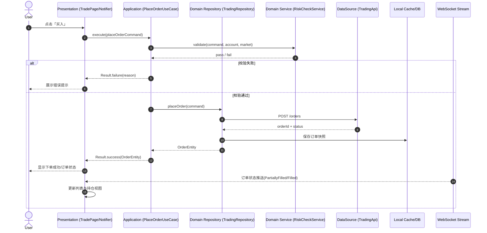

# Flutter 交易所架构实战：DDD + Clean 落地指南

交易所项目做到一定规模，就会开始还之前欠下的债——页面里写 API、规则到处复制、改一处牵十处。

用 `DDD + Clean` 不是为了架构好看，是因为不用它的话，这类项目很难不失控。

这篇不讲大而空的概念，只讲三个问题：

1. 为什么交易所需要 `DDD + Clean`
2. 在 Flutter 里到底怎么分层
3. 一笔下单请求如何在系统里流转（含时序图）

---

## 一、为什么交易所适合 DDD + Clean

交易所天然是“复杂业务系统”，不是普通内容 App。你会长期面对：

- 订单状态机（New / PartiallyFilled / Filled / Canceled）
- 实时行情推送（WebSocket）
- 风控规则（余额、仓位、价格精度、限价带）
- 多上下文协作（交易、钱包、行情、结算）

如果没有明确边界，最常见结局就是：

- 页面里直接写 API 与业务规则
- 同一规则复制到多个模块
- 一改就牵一发动全身

`DDD` 负责把业务模型建正确，`Clean` 负责把依赖关系管正确。  
两者组合，刚好对症。

---

## 二、先分上下文，再做分层

别先想文件夹，先切业务上下文（Bounded Context）：

- `Trading`：下单、撤单、订单状态流转
- `Market`：K线、深度、ticker
- `Wallet`：充值、提现、资产余额
- `Risk`：规则校验、风控拦截

然后每个上下文内部用 Clean 四层：

- `Presentation`：页面与交互状态
- `Application`：UseCase 编排流程
- `Domain`：实体、值对象、领域规则、仓储接口
- `Data`：HTTP/WS/DB/SDK 具体实现

依赖方向必须固定：

`Presentation -> Application -> Domain`  
`Data -> Domain（实现接口）`

等价写法是：`Presentation -> Application -> Domain <- Data`。  
注意这里不是双向依赖，`Domain` 仍然是最内层，不依赖外层实现。

---

## 三、Flutter 目录怎么落

以交易模块为例，一个可执行模板如下：

```txt
features/trading/
  presentation/
    pages/
    state/                # Notifier / State
  application/
    usecases/             # PlaceOrderUseCase, CancelOrderUseCase
  domain/
    entities/             # Order, Position, TradeFill
    value_objects/        # Price, Quantity, Symbol
    repositories/         # TradingRepository (abstract)
    services/             # RiskCheckService
  data/
    datasources/          # TradingApi, TradingWs
    models/               # DTO
    mappers/              # DTO <-> Entity
    repositories/         # TradingRepositoryImpl
```

一个实用判断标准：  
如果你的页面里出现 `dio.post('/orders')`，分层基本就已经破了。

---

## 四、下单链路时序图（核心）

下面这张图就是 `DDD + Clean` 的核心价值：  
流程清晰、职责独立、边界稳定。



---

## 五、三条强约束（别妥协）

### 1) Domain 层不依赖框架

`Domain` 不能依赖 Flutter、Dio、数据库 SDK。  
它只表达业务规则，不表达技术细节。

### 2) UseCase 不直接访问 DataSource

UseCase 只能依赖 `Domain Repository` 接口。  
Data 层在外面实现接口并注入。

### 3) DTO 不进业务层

接口返回结构只在 Data 层存在，必须经过 Mapper 转成 `Domain Entity` 再进入流程。

---

## 六、跨上下文场景怎么编排

实际做下来最绕的是这种场景：`Trading` 下单时，需要引用 `Wallet` 的余额能力和 `Market` 的行情能力。

核心原则只有一句话：  
**在 Application 层编排，在 Domain 层守规则，在 Data 层做实现。**

### 场景 1：下单依赖余额 + 行情（最常见）

比如用户限价买入 BTC，流程建议是：

1. `PlaceOrderUseCase` 接收下单命令（symbol/price/qty/side）
2. 通过 `WalletReadRepository` 查询可用余额
3. 通过 `MarketReadRepository` 获取最新价、最小价格步长、交易对状态
4. 调用 `RiskCheckService` 做领域校验（余额是否足够、精度是否合法、是否超限价带）
5. 校验通过后再调用 `TradingRepository.placeOrder()`
6. 返回 `OrderEntity` 给 UI

这里有个边界细节很重要：  
`PlaceOrderUseCase` 可以同时依赖多个 **Domain 接口**，但不能直接依赖多个 API Client。  
也就是可以“跨上下文读能力”，但不能“跨层直连实现”。

### 场景 2：撤单后释放冻结资金

这个场景常见坑是“订单状态改了，但余额没对齐”。  
推荐做法是把它当成一个应用编排事务：

1. `CancelOrderUseCase` 请求撤单
2. Trading 返回最终状态 `Canceled`
3. UseCase 调用资金域的 `releaseFrozen(orderId)`
4. 成功后统一回写本地状态并刷新 UI

如果你们后端是事件驱动，也可以改成：

- 交易域发 `OrderCanceledEvent`
- 钱包域消费后释放冻结
- 前端靠订单流 + 余额流最终一致

前端不要在 UI 里手动“猜余额”，而是订阅权威状态流。

### 场景 3：行情波动触发风控提示（但不直接改订单）

例如价格短时剧烈波动时，你希望提示用户“当前滑点风险高”。  
这个能力应该是“提示编排”，不是“静默改单”：

1. `Market` 推送波动指标
2. `RiskHintUseCase` 计算提示等级
3. UI 展示 risk banner / toast
4. 用户二次确认后再走下单 UseCase

这样可以避免一个隐患：  
行情模块直接改交易参数，导致行为不可解释、难审计。

### 一个可落地的编排模板

```txt
Presentation (TradePage)
  -> PlaceOrderUseCase
      -> WalletReadRepository (Domain Interface)
      -> MarketReadRepository (Domain Interface)
      -> RiskCheckService (Domain Rule)
      -> TradingRepository (Domain Interface)
```

你可以把它理解成：  
**应用层是“调度台”，领域层是“裁判”，数据层是“执行队”。**

---

## 八、Domain Entity 不是 DTO：以订单状态机为例

很多项目里 `OrderEntity` 只是一堆字段，本质还是 DTO 换了个名字。真正的领域对象要**有行为，能守规则**。

```dart
class OrderEntity {
  final String orderId;
  final OrderStatus status;
  final Price price;
  final Quantity quantity;
  final Quantity filledQuantity;

  // 状态转换：只有合法转换才能发生
  OrderEntity fill(Quantity qty) {
    assert(status == OrderStatus.open || status == OrderStatus.partiallyFilled);
    final newFilled = filledQuantity + qty;
    final newStatus = newFilled >= quantity
        ? OrderStatus.filled
        : OrderStatus.partiallyFilled;
    return copyWith(filledQuantity: newFilled, status: newStatus);
  }

  OrderEntity cancel() {
    if (status == OrderStatus.filled) {
      throw DomainException('已成交订单不能撤销');
    }
    return copyWith(status: OrderStatus.canceled);
  }

  // 只读计算属性，不存储
  Quantity get remainingQuantity => quantity - filledQuantity;
  double get fillRate => filledQuantity.value / quantity.value;
}
```

`fill()` 和 `cancel()` 把状态转换的**合法性检查**放进实体，UseCase 不需要再重复这些判断。这就是”领域层守规则”的字面意思。

---

## 九、Value Object 承载精度规则

价格精度和数量精度是交易所里极高频的业务规则，如果散落在 UI 层或 UseCase 里，几乎必然会出现遗漏和不一致。

```dart
class Price {
  final BigDecimal value;
  final int tickSize; // 最小价格步长的小数位

  Price(this.value, {required this.tickSize}) {
    // 构造时就校验，不合法的 Price 根本不存在
    if (!_isAlignedToTick(value, tickSize)) {
      throw DomainException('价格 $value 不符合步长精度 $tickSize');
    }
  }

  bool _isAlignedToTick(BigDecimal v, int tick) {
    final scale = BigDecimal.fromInt(10).pow(tick);
    return (v * scale).remainder(BigDecimal.one) == BigDecimal.zero;
  }

  Price operator +(Price other) => Price(value + other.value, tickSize: tickSize);
}

class Quantity {
  final BigDecimal value;
  final BigDecimal minLot;  // 最小下单量
  final BigDecimal stepSize; // 数量步长

  Quantity(this.value, {required this.minLot, required this.stepSize}) {
    if (value < minLot) throw DomainException('数量低于最小下单量');
    if (!_isAlignedToStep(value, stepSize)) throw DomainException('数量不符合步长');
  }
}
```

`Price` 和 `Quantity` 是值对象：构造时即校验，非法值根本无法创建。`RiskCheckService` 里就不用再写一遍这些规则了。

---

## 十、乐观更新（Optimistic Update）

用户点击”买入”后，等服务端响应再更新 UI，体验很差——尤其是网络延迟高的时候。乐观更新的做法是先假设成功，服务端失败再回滚。

```dart
class PlaceOrderUseCase {
  Future<Result<OrderEntity>> execute(PlaceOrderCommand command) async {
    // 1. 先在本地创建一个 pending 状态的订单
    final optimisticOrder = OrderEntity.pending(
      clientOrderId: command.clientOrderId,
      price: command.price,
      quantity: command.quantity,
    );

    // 2. 立刻推给 UI
    _orderStreamController.add(optimisticOrder);

    try {
      // 3. 发请求
      final confirmed = await _repo.placeOrder(command);
      // 4. 用服务端返回的真实状态替换 pending
      _orderStreamController.add(confirmed);
      return Result.success(confirmed);
    } catch (e) {
      // 5. 失败：移除 pending 订单，回滚 UI
      _orderStreamController.add(optimisticOrder.copyWith(
        status: OrderStatus.failed,
        errorMessage: e.toString(),
      ));
      return Result.failure(e);
    }
  }
}
```

关键设计：
- `clientOrderId` 由客户端生成（UUID），不依赖服务端 ID，乐观状态下就有唯一标识
- 服务端确认后用真实 orderId 替换，前端做 id 对齐
- 失败时明确标记为 `failed`，不要静默消失

---

## 十一、并发下单保护

用户快速双击”买入”，或者网络抖动导致重试，很容易触发重复下单。这个保护要在 Application 层做，不能靠 UI 的按钮 disabled——按钮状态在竞态下不可靠。

```dart
class PlaceOrderUseCase {
  final _inFlight = <String, Future<Result<OrderEntity>>>{};

  Future<Result<OrderEntity>> execute(PlaceOrderCommand command) {
    final key = '${command.symbol}-${command.clientOrderId}';

    // 如果同一笔请求已经在飞，直接返回同一个 Future
    if (_inFlight.containsKey(key)) {
      return _inFlight[key]!;
    }

    final future = _doPlaceOrder(command).whenComplete(() {
      _inFlight.remove(key);
    });

    _inFlight[key] = future;
    return future;
  }
}
```

`clientOrderId` 由调用方在命令里生成，同一笔命令重复调用 UseCase，只会执行一次网络请求，后续调用返回同一个 Future。

---

## 十二、错误分层：Domain Error vs Infrastructure Error

错误处理是最容易乱的地方。常见反模式是把 `DioException` 直接抛到 UI，然后 UI 里 catch 一堆不同类型的异常写不同提示。

正确的做法是在层边界做转换：

```dart
// Domain 层只有业务错误
sealed class DomainError {
  const DomainError();
}
class InsufficientBalance extends DomainError {
  final double required;
  final double available;
}
class PricePrecisionError extends DomainError {
  final String detail;
}
class OrderAlreadyCanceled extends DomainError {}

// Data 层捕获基础设施错误，映射成 Domain Error 或 AppError
class TradingRepositoryImpl implements TradingRepository {
  @override
  Future<OrderEntity> placeOrder(PlaceOrderCommand command) async {
    try {
      final response = await _api.placeOrder(command.toDto());
      return _mapper.toDomain(response);
    } on DioException catch (e) {
      // HTTP 业务错误 -> Domain Error
      if (e.response?.statusCode == 400) {
        final code = e.response?.data['code'];
        throw _mapApiErrorToDomain(code, e.response?.data);
      }
      // 网络错误 -> AppError（基础设施层的错误）
      throw NetworkError(message: e.message);
    }
  }

  DomainError _mapApiErrorToDomain(String code, Map? data) => switch (code) {
    'INSUFFICIENT_BALANCE' => InsufficientBalance(
        required: data?['required'] ?? 0,
        available: data?['available'] ?? 0,
      ),
    'PRICE_PRECISION_ERROR' => PricePrecisionError(detail: data?['message'] ?? ''),
    _ => UnknownDomainError(code: code),
  };
}
```

UI 只需要处理 `DomainError` 和 `AppError` 两种，不用知道底层用的是 Dio 还是 http。

---

## 十三、怎么增量迁移（不是推倒重来）

如果你项目已经很大，不要全量重构，按下面顺序迁移：

1. 新功能先按 `DDD + Clean` 落
2. 高风险链路优先抽（下单、撤单、资金变更）
3. 旧页面逐步替换成 UseCase 调用
4. 最后再清理历史耦合代码

这套做法的好处是：业务不停、风险可控、每周都能看到结构改善。

---

## 总结

在交易所场景里，`DDD + Clean` 不是为了”显得高级”，而是为了让系统在复杂规则和高频变更下还能稳定进化。

真正落地的关键不只是目录结构，而是这几点：

| 问题 | 解决方案 |
|------|---------|
| 业务规则散落 | Entity 有行为，Value Object 构造即校验 |
| UI 体验差 | Optimistic Update + pending 状态 |
| 重复下单 | UseCase 层 in-flight 去重 |
| 错误处理混乱 | 层边界做错误转换，UI 只看 DomainError |
| 跨上下文耦合 | Application 层编排，Domain 接口隔离 |

先把边界画清，再把流程做薄，架构才会真正服务业务，而不是拖慢业务。
